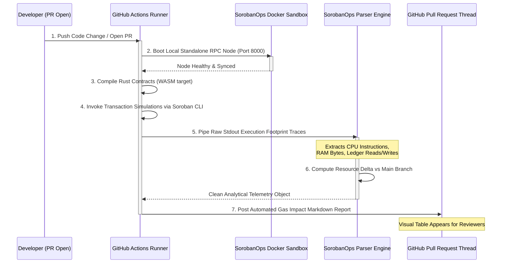

#  SorobanOps Network

**Automating continuous integration, gas profiling, and optimization safeties for Stellar smart contracts.**

SorobanOps Network is an open-source infrastructure suite built to eliminate manual gas profiling and unexpected resource consumption regressions in the Stellar ecosystem. By running isolated, automated simulations on every single Pull Request, we empower Soroban engineers to ship highly optimized Rust code with total resource visibility before hitting mainnet deployment layers.

---

## Ecosystem Repositories

The network is decoupled into atomic modules to allow global contributors to scale specific protocol components during active contribution sprints.

*  **[`soroban-ops-action`](https://github.com/SorobanOps-Network/soroban-ops-action)**: The core TypeScript GitHub Custom Action runner. Handles transaction simulation trace parsing, delta accounting, and automated markdown reports generation.
*  **[`soroban-ops-docker`](https://github.com/SorobanOps-Network/soroban-ops-docker)**: Isolated orchestration environment layers. Maintains plug-and-play multi-stage containers managing `stellar/quickstart` image instances optimized for high-throughput testing cycles.

---

##  Pipeline Automation Flow

SorobanOps hooks into your standard branch workflows, executing gas trace validations natively within isolated runner environments.

---

## Strategic Roadmap  
### Phase 1: Local Automation & Core Engine (Current)  
* Deliver robust **CLI** parsing patterns for Soroban structural changes.

* Finalize stable release of the official soroban-ops-action custom GitHub Action workflow node.

* Complete local sandboxing profiles using standard container environments.

### Phase 2: Security Linting & Interception Gates  
* Integrate specialized automated Rust linter hooks directly into simulation steps.

* Introduce configurable *Gas Regression Alert Thresholds* to fail builds automatically if consumption increases uncontrollably (e.g., greater than 15%).

* Roll out mock assertion tooling for state tracking simulations.

### Phase 3: Telemetry Dashboards & Multi-Branch Aggregations  
* Build distributed ingestion adapters to stream execution history parameters over long timelines.

* Launch cloud telemetry dashboards to map optimizations changes across protocol versions.

* Establish formal integration pipelines for major automated development toolkits in the Stellar ecosystem.

## Contributing & Wave Programs  
SorobanOps Network is fully open-source and built to power public developer tooling infrastructure. We organize our engineering sprint issues around strict difficulty bounds to make onboarding intuitive.

* Want to contribute? Look for active issues tagged with drips-wave and pick a task mapped to your skillset.

* Guidelines: Review our global **CONTRIBUTING**.md and CODE_OF_CONDUCT.md policies before pushing branches.

* Security: For disclosure procedures regarding infrastructure vulnerabilities, see **SECURITY**.md.

© **2026** SorobanOps Network. Engineered for the Stellar Developer Ecosystem.  